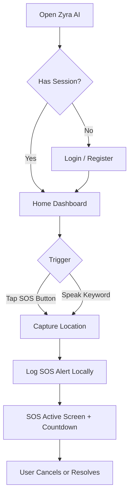
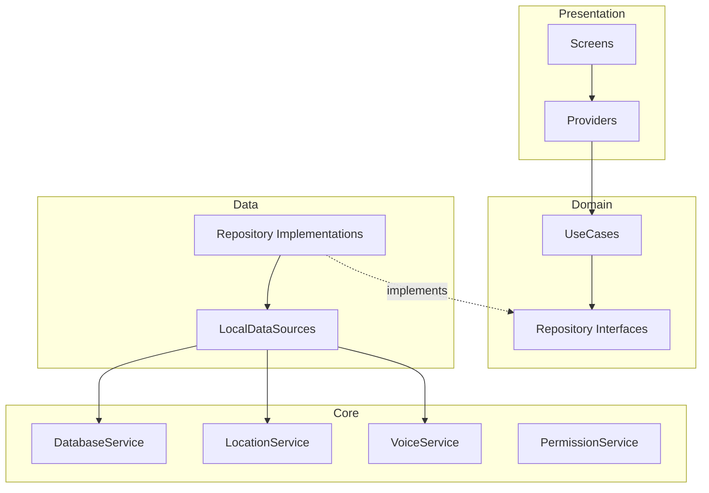

# Zyra AI

### Intelligent Personal Safety Assistant

**"One tap. One voice. One safer way home."**


**GitHub Repository:** [`Zeenat-25/Zyra-AI`](https://github.com/Zeenat-25/Zyra-AI)

---

## About Zyra AI

Zyra AI is a cross-platform (Android/iOS) mobile safety application built with Flutter. It gives users a single, always-within-reach place to trigger an emergency alert, manage a list of trusted emergency contacts, and share their live location — all from one home screen instead of hunting through multiple apps during a stressful moment.

It is designed for anyone who wants a faster, calmer way to reach for help — commuters walking alone at night, students on campus, delivery workers, or family members who simply want peace of mind. What sets Zyra apart at this stage is its **hands-free voice trigger**: the app can listen for a configurable emergency keyword (like "help" or "sos") and start an SOS flow without the user needing to touch the screen.

## The Problem

In a stressful or unsafe situation, every extra step costs time and composure. Common pain points Zyra AI is built around:

- Unlocking a phone, finding the right app, and tapping through several screens takes precious time during a crisis.
- Manually sharing a live location with someone else is fiddly under stress.
- Emergency contacts are often buried in a general contacts list rather than being one tap away.
- Existing safety apps can be cluttered, making the one action that matters — "get help now" — harder to find.
- Sometimes hands aren't free at all, and a purely touch-based interface isn't enough.

## The Solution

Zyra AI centers the entire experience around a single, obvious safety action, reachable either by tapping the SOS button or by speaking a configured keyword.

```text
User
  ↓
Zyra AI (Home Dashboard)
  ↓
SOS Trigger (Tap or Voice Keyword)
  ↓
Location Captured + Alert Logged
  ↓
Emergency Contacts Ready to Notify
```

---

## Key Features

### Currently Implemented

**User Accounts**
Local registration and login using name, email/phone, and password, backed by an on-device SQLite database.

**SOS Alert**
A large, animated SOS button that captures the user's current GPS location and logs a timestamped alert (with a 10-second cancellable countdown) to the local database.

**Voice-Activated SOS**
Hands-free trigger built on on-device speech recognition (`speech_to_text`). The app listens for configurable keywords (default: "help", "emergency", "sos", "danger", etc.) and can kick off the same SOS flow without a tap.

**Emergency Contacts**
Add, view, mark-as-emergency, and delete trusted contacts, stored locally and tied to the logged-in user.

**Live Location**
A dedicated location screen that fetches the current GPS position, can start/stop continuous location tracking, and reverse-geocodes coordinates into a readable address.

**SOS History**
Past SOS alerts (with location and trigger type — manual or voice) are stored and retrievable per user.

**Light/Dark Theme**
App-wide theme switching via a dedicated theme provider.

**Responsive Layout**
Shared layout utilities that adapt padding and sizing across phone and tablet screens.

### Future Features

> **Future Scope — not currently implemented.** See [Future Scope](#future-scope) below.

---

## How It Works



---

## Application Screens

| Screen | Purpose |
| ------ | ------- |
| Splash | App launch screen, checks for an existing session. |
| Login | Sign in with saved credentials. |
| Register | Create a new local account. |
| Home Dashboard | Central hub with greeting, quick actions, and the SOS entry point. |
| SOS | Full-screen emergency trigger with animated button, countdown, and cancel/resolve controls. |
| Emergency Contacts | List, add, and manage trusted contacts. |
| Add Contact | Form to add a new emergency contact. |
| Location | View current location, start/stop live tracking. |
| Voice Settings | Enable/disable voice detection and manage SOS keywords. |

---

## Technology Stack

### Frontend
- Flutter
- Dart

### State Management
- Provider (`ChangeNotifier` / `MultiProvider`)

### Services
- `geolocator` — GPS location, tracking, and reverse geocoding
- `speech_to_text` — on-device voice recognition for keyword detection
- `flutter_sound` — audio recording capability
- `permission_handler` — runtime permission requests
- `google_maps_flutter` — map rendering (requires an API key to be supplied)
- `url_launcher`, `flutter_phone_direct_caller` — included as dependencies for future calling/linking features

### Storage
- `sqflite` (local SQLite database) — users, contacts, SOS alerts, voice commands
- `shared_preferences` — session and settings persistence

### Development Tools
- `flutter_lints` for static analysis
- `flutter_test` for widget testing

Android and iOS are both configured in the project (`android/` and `ios/` directories are present and set up for a standard Flutter build).

---

## Architecture

Zyra AI follows a **feature-first Clean Architecture** pattern, with each feature (`auth`, `home`, `sos`, `contacts`, `location`, `voice`) split into its own presentation/domain/data layers.

```text
Presentation (Screens, Providers)
     ↓
Domain (Entities, Use Cases, Repository Interfaces)
     ↓
Data (Repository Implementations, Models, Local Data Sources)
     ↓
Core / Services (Database, Location, Voice, Permissions, Preferences)
```



### Presentation Layer
Flutter widgets (`screens/`) and `ChangeNotifier` providers per feature, which hold UI state and call into use cases.

### Domain Layer
Plain Dart entities, abstract repository contracts, and single-purpose use case classes (e.g. `TriggerSosUseCase`, `GetCurrentLocationUseCase`).

### Data Layer
Repository implementations and SQLite-backed local data sources that convert between database rows and domain models.

### Core / Services
Shared, feature-agnostic services: `DatabaseService` (SQLite setup), `LocationService` (Geolocator wrapper), `VoiceService` (speech-to-text wrapper), `PermissionService`, `PreferencesService`, plus shared theming and responsive-layout utilities.

---

## Project Structure

```text
zyra-ai/
├── lib/
│   ├── main.dart                 # App entry point
│   ├── app.dart                  # MultiProvider + MaterialApp setup
│   ├── routes/
│   │   └── app_router.dart       # Named route generation
│   ├── core/
│   │   ├── constants/            # App-wide constants (keywords, DB name, etc.)
│   │   ├── errors/               # Failure types
│   │   ├── providers/            # Theme provider
│   │   ├── services/             # Database, Location, Voice, Permission, Preferences
│   │   ├── theme/                # Light/dark app theme
│   │   ├── utils/                # Validators, responsive helpers
│   │   └── widgets/common/       # Shared buttons, text fields, loading overlay
│   └── features/
│       ├── auth/                 # Login, register, session
│       ├── home/                 # Home dashboard
│       ├── sos/                  # SOS trigger, alert history
│       ├── contacts/             # Emergency contacts CRUD
│       ├── location/             # Live location & tracking
│       └── voice/                # Voice keyword detection & settings
├── assets/
│   ├── images/
│   └── icons/
├── android/                      # Android platform project
├── ios/                          # iOS platform project
├── test/                         # Widget tests
├── pubspec.yaml
└── README.md
```

---

## Installation

**Prerequisites:** Flutter SDK compatible with Dart `^3.2.0`, and Android Studio / Xcode for platform builds.

```bash
git clone https://github.com/Zeenat-25/Zyra-AI.git

cd Zyra-AI

flutter pub get

flutter run
```

---

## Configuration

Zyra AI does **not** require any `.env` file or backend API key to run its core local features (auth, SOS logging, contacts, location, voice keywords all work fully offline against the local SQLite database).

One piece of configuration is required for the map feature:

- **Google Maps API Key** — the Android manifest (`android/app/src/main/AndroidManifest.xml`) contains a placeholder `YOUR_GOOGLE_MAPS_API_KEY` value that must be replaced with a real key for `google_maps_flutter` to render maps.

No Firebase, Supabase, or other backend project setup is required — the app does not currently call any remote API.

---

## Permissions

The following permissions are declared in the Android manifest and iOS `Info.plist`:

| Permission | Purpose |
| ---------- | ------- |
| Location (fine/coarse/background) | Capture and share the user's position during an SOS alert and for live tracking. |
| Microphone | Enable on-device speech recognition for voice-activated SOS. |
| Speech Recognition (iOS) | Required alongside microphone access for keyword detection. |
| Contacts | Assist in adding emergency contacts. |
| Phone (Android) | Declared for future call-related functionality. |
| Storage | Declared for reading/writing local files and media. |
| Notifications | Declared for future alert notifications. |
| Camera / Photo Library (iOS) | Declared for potential future safety-media features. |

Several permissions (phone, storage, contacts, notifications, camera) are requested/declared ahead of the corresponding feature being fully wired up in the app logic — this is common at this stage of development and is flagged transparently here rather than implied as active functionality.

---

## Security & Privacy

Zyra AI is not currently a production-hardened application, and this section describes its actual current state rather than an idealized one:

- **Local-first storage:** User accounts, emergency contacts, and SOS alert history are stored locally on-device in an SQLite database — nothing is currently transmitted to a remote server.
- **Authentication is basic:** The database schema includes a `passwordHash` column, but the current login flow looks up a user by email/phone and does not yet verify a password against it. This is a known gap to close before treating login as a real security boundary.
- **Location and contact data stay on-device:** Since there is no backend integration yet, this data isn't exposed to any third-party service, but it is also not backed up or encrypted at rest beyond what the OS provides by default.
- **Broad permission requests:** Several permissions are requested up front for planned features; only grant what you're comfortable with if features that use them aren't active yet.

Do not treat the current build as a substitute for calling local emergency services in a real emergency.

---

## Use Cases

### Feeling Unsafe Walking Alone
A user opens the app, taps the SOS button, and their location is immediately captured and logged with a cancellable countdown — ready to be acted on.

### Hands-Free Activation
If a user's hands are occupied or unsafe to use, they can speak a configured keyword like "help" and the same SOS flow starts automatically.

### Keeping Trusted Contacts Ready
A user pre-populates their emergency contacts list ahead of time so it's ready to reference the moment an SOS is triggered.

### Sharing a Live Route
Before walking somewhere unfamiliar, a user can open the Location screen and start live tracking to keep an eye on their own path.

---

## Future Scope

> **Future Scope — NOT currently implemented.**

- Automatic SMS/call dispatch to emergency contacts on SOS trigger
- AI-powered danger detection and risk prediction
- Fall detection and automatic incident detection
- Wearable / smartwatch integration
- Multilingual voice assistant
- Offline emergency functionality without connectivity
- Direct emergency-service (police/ambulance) integration
- Cloud backup and multi-device sync
- End-to-end encrypted contact/location data

---

## Roadmap

- [x] Local authentication (registration & login flow)
- [x] SOS trigger (manual + voice) with location capture
- [x] Emergency contacts management
- [x] Live location screen with tracking toggle
- [x] Voice keyword configuration
- [x] Light/dark theme and responsive layout
- [ ] Password verification for login
- [ ] Actual SMS/call notification to emergency contacts
- [ ] Google Maps API key wiring for production
- [ ] AI-powered danger detection
- [ ] Wearable integration
- [ ] Offline emergency support

---

## Why Zyra AI?

Zyra AI's value is in simplicity: one screen, one button, one voice command — instead of navigating a stack of menus while under stress. Voice-triggered SOS means help can be requested even when tapping a screen isn't practical. Because everything currently runs locally, there's no dependency on a backend being online for the core safety flow to work.

---

## Development

The codebase follows a feature-first Clean Architecture split (presentation / domain / data / core), which keeps each safety feature (SOS, contacts, location, voice, auth) independently testable and easy to extend without touching unrelated code. A `test/` directory with widget tests is included as a starting point for expanding test coverage.

---

## Contributing

This is an open, student/hackathon-stage project — contributions are welcome.

1. Fork the repository
2. Create a feature branch (`git checkout -b feature/your-feature`)
3. Make your changes
4. Test the project (`flutter test`, `flutter run`)
5. Submit a pull request

---

## License

> License information will be added in a future release.

---

## Team

| Name | Role |
|------|------|
| Zeenat | Developer |

---

## Acknowledgement

Zyra AI is an ongoing effort to make personal safety technology simpler and more accessible — reducing the number of steps between "I need help" and help actually being on its way.
